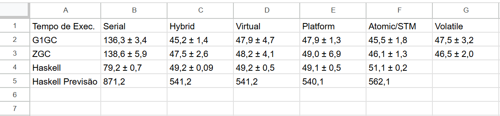
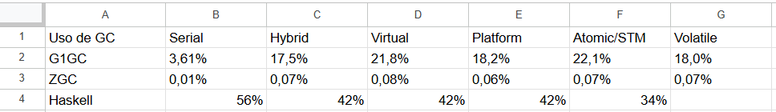
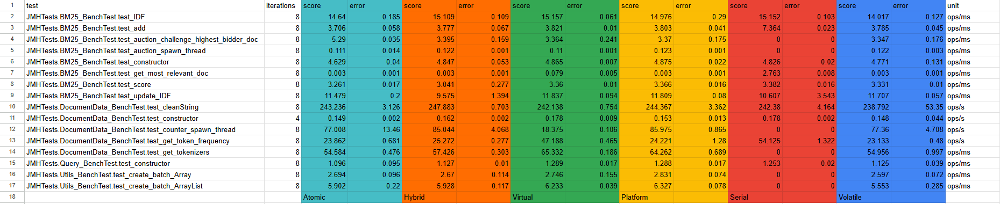
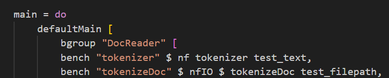
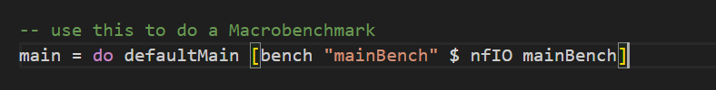

# Prog Conc

This is a repository I used for a project of the Concurrent Programming subject in UFRN, taught by the Professor Nélio Cacho. The project consists of determining the difference between a serial and concurrent implementations of the [BM25 algorithm](https://en.wikipedia.org/wiki/Okapi_BM25) in two programming languages (Java and, in my case, Haskell), each one with versions that utilize different concurrent abstractions.

## Report and Experimental Results

The report, which is in portuguese, can be found in the root directory under the name `Relatório___Programação_Concorrente.pdf`. It summirizes the results into tables, like the following ones:

(Summary of the Execution time, in seconds, for each version)

(Summary of the GC usage for each version. More specifically, the amount of time the application paused for a GC)

(Summary of the Microbenchmark results done with JMH for each relevant method in the algorithm)

But the sources can be found in a `results` folder in each version directory.

## Which versions where implemented?

The implemented Java versions are as follows:
- Virtual: A version with only Virtual Threads and `synchronized`.
- Platform: A version with only Platform Threads and `synchronized`.
- Hybrid: A hybrid version (Platform and Virtual Threads) with `synchronized`.
- Atomic: A hybrid version with Atomic variables.
- Volatile: A hybrid version with Volatile variables.

The implemented Haskell versions are as follows:
- Virtual: A version with `forkIO` threads and `MVar`s.
- Platform: A version with `forkOS` threads and `MVar`s.
- Hybrid: A hybrid version (`forkIO` and `forkOS` threads) with `MVar`s.
- STM: A hybrid version with `TVar`s

## ...and what was the best version?

Considering runtime, the best version was the **Hybrid in Java with G1GC**. It had an average execution time of 45.2 seconds for a dataset of 1.1 GB.

## A Caveat

The Haskell versions were executed with a subset of only 106 MB because of excessive memory use and prolonged execution times. This is probably due to my poor use of the language, not because of it's actual performance, since I had to learn Haskell from scratch for this project with no (practical) experience in functional programming 😅.

## The Dataset

The dataset consists of pdf files such as books, articles and slides. It can be found in `data` and was derived from https://github.com/tpn/pdfs.

# How to run the versions?
Java use IntelliJ with flags -Xms512m -Xmx1g -XX:+UseStringDeduplication
Haskell `ghc -O2 -threaded -package directory -package text -package deepseq Main.hs`
warn about flags

# Java

I used IntelliJ (with a student account) to run the Java projects, i advise you to do the same to avoid annoying package or IDE conflicts. In my experiments I used the following flags: `-Xms512m -Xmx1g -XX:+UseStringDeduplication`

JDK Version 24.

## How to run JMH tests?

Execute: `mvn clean install compile`.

Run JMH's main: `JMHTests.JMHTest`.

## How to run JCStress tests?

Ideally, this would be done very similarly to the JMH execution, but JCStress and JMH both use a folder called `META-INF`, causing a conflict that makes JCStress not run. I managed to solve this by commenting all the JMH files and removing the package from `pom.xml`, but i suggest searching for a better solution.

So, assuming the conflict is resolved:

Execute `mvn clean install compile`.

Run JCStress's main: `org.openjdk.jcstress.Main`.

## How to run JMeter tests?

The JMeter `main` for every version is present in the folder `JMeterTests`, in the same directory as the versions.

Execute `mvn clean install compile` inside that project (only for JMeterTests) and put the generated jar inside `<jmeter_folder>/lib/ext`.

You also need to include the used jars from the versions you want to test, and the utilized library jars, namely: `pdfbox`, `fontbox`, `jopt`, `jna`, `commons-math` and `cmdrunner`.

## How to use JFR?
Add the flag `-XX:StartFlightRecording=filename=flight_name.jfr` to the Java execution.

## How to use different GC's?

Add the desired GC flag to the Java execution:

- `-XX:+UseG1GC`

- `-XX:+UseParallelGC`

- `-XX:+UseZGC -XX:+ZGenerational`

- `-XX:+UseZGC`

# Haskell

I compiled my Haskell programs with the following command: `ghc -O2 -threaded -package stm -package text -package deepseq -package directory --make Main.hs`

Why all the `package` flags? Well, I struggled a bit correctly configuring packages with cabal and ended up having to set those flags manually. Even if your packages are configured correclty, they shouldn't be a problem.

The execution was done with: `./Main +RTS -Nx`, [where 'x' is the number of cores you have (or a slightly higher value)](https://wiki.haskell.org/Haskell_for_multicores). In my case, i used `x = 6`.

GHC Version 8.10.7.

## How to run Criterion

Go inside the respective version directory.

### Selecting Microbenchmark

Inside `tests/Criterion/Profile<version>.hs`, make the `main` function correspond (only) to the code that benchmarks each individual method. It should look something like this: 

### Selecting Macrobenchmark

Inside `tests/Criterion/Profile<version>.hs`, make the `main` function correspond (only) to the code that benchmarks `mainBench`. On the end of the file, there should already be a commented method that does that, just uncomment it like this: 

### After Selection

Remember to locate yourself in the root of the respective version directory.

Compile the test file with `ghc -O2 -threaded -package criterion -package directory -package text -package deepseq -i. tests/Criterion/Profile<version>.hs -o Profile<version>.exe`.

Example: `ghc -O2 -threaded -package criterion -package directory -package text -package deepseq -i. tests/Criterion/ProfileSerial.hs -o ProfileSerial.exe`.

Then, execute with `./Profile<version>.exe +RTS -Nx --output profile.html`.

That should generate the results.

[Reference](https://github.com/haskell/criterion).

## How to run ghc-events-analyze

Go inside the respective version directory.

Compile the Haskell program with `ghc -O2 -threaded -rtsopts -eventlog -package text -package directory -package deepseq --make Main.hs`.

Then, execute with `./Main +RTS -Nx -ls`.

That should create a `.eventlog` file. Execute `ghc-events-analyze` with it to generate the results.

Example: `./ghc-events-analyze Main.eventlog`

[Reference](https://well-typed.com/blog/2014/02/ghc-events-analyze/).
